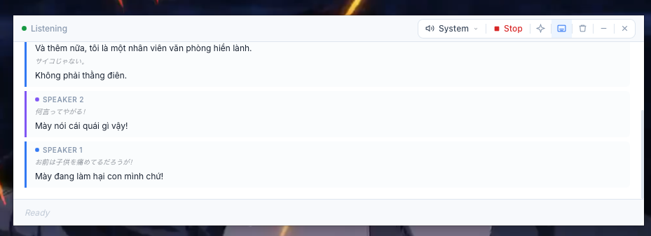
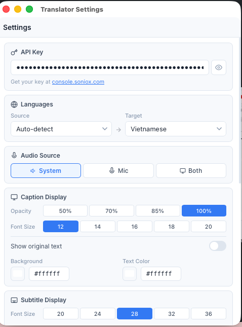

# Translator

Real-time speech translation app for macOS. Captures system audio or microphone input, transcribes and translates it live using [Soniox](https://soniox.com), and displays results in a caption window or Netflix-style subtitle overlay.

## Screenshots

### Subtitle Overlay


### Caption Window


### Settings


## Features

### Live Translation
- Real-time speech-to-text with translation via Soniox API
- Supports multiple source languages (auto-detect, English, Japanese, Korean, Chinese, etc.)
- Translate to Vietnamese, English, Japanese, Korean, Chinese, French, German, Spanish, Thai, Indonesian
- Speaker diarization — identifies different speakers in the conversation

### Audio Sources
- **System Audio** — capture any audio playing on your Mac (requires Screen Recording permission)
- **Microphone** — capture live speech from your mic
- **Both** — capture system audio and microphone simultaneously

### Caption Window
- Frameless, always-on-top floating window
- Draggable toolbar with playback controls
- Customizable font size, opacity, background color, text color
- Show/hide original text alongside translation
- Scrollable transcript history with auto-scroll to latest

### Subtitle Overlay (Netflix-style)
- Transparent overlay at the bottom of the screen
- Click-through — doesn't block interaction with apps underneath
- Current line displayed prominently, previous line smaller and faded
- Auto-clears after a few seconds of silence
- Independent font size, colors, and show-original settings

### AI Assistant
- Built-in AI chat panel powered by Claude (Anthropic API)
- Ask questions about the conversation context
- Analyze statements and get suggested responses
- Supports Claude Haiku, Sonnet, and Opus models

### Tray Menu
- Start/Stop live translation from the menu bar
- Switch source/target languages
- Toggle audio input source
- Toggle AI Assistant and Subtitle Overlay
- Open Settings and View History
- Keyboard shortcuts for common actions

### Other
- Custom context (domain + terms) for improved transcription accuracy
- Translation history with session tracking and export
- Voice input mode (Cmd+L)
- Settings window with full configuration

## Keyboard Shortcuts

| Shortcut | Action |
|----------|--------|
| `Cmd+Return` | Start/Stop translation |
| `Cmd+L` | Voice input |
| `Cmd+,` | Open Settings |
| `Cmd+H` | View History |

## Installation

### From Release

1. Download the latest `.dmg` from Releases
2. Drag `Translator.app` to `/Applications`
3. **Bypass macOS Gatekeeper** (unsigned app):
   ```bash
   xattr -cr /Applications/Translator.app
   ```
4. Open the app — it runs in the menu bar (no Dock icon)

### Build from Source

Prerequisites: Node.js 18+, Rust 1.70+, macOS 13+

```bash
git clone <repo-url>
cd translator
npm install
npm run tauri build
```

The built app will be at:
```
src-tauri/target/release/bundle/dmg/Translator_0.1.0_aarch64.dmg
src-tauri/target/release/bundle/macos/Translator.app
```

To bypass Gatekeeper on the built app:
```bash
xattr -cr src-tauri/target/release/bundle/macos/Translator.app
```

### Development

```bash
npm run tauri dev
```

## Configuration

On first launch, open Settings (`Cmd+,` or tray menu) and configure:

1. **Soniox API Key** — See [Getting a Soniox API Key](#getting-a-soniox-api-key) below
2. **Source/Target Languages** — Select your preferred languages
3. **Audio Source** — Choose System, Microphone, or Both
4. **(Optional) Anthropic API Key** — For AI Assistant features
5. **(Optional) Custom Context** — Domain and terms for better accuracy

## Getting a Soniox API Key

1. Go to [console.soniox.com/signup](https://console.soniox.com/signup/)
2. Create a free account (Google or email sign-up)
3. After signing in, go to **API Keys** in the left sidebar
4. Click **Create API Key**
5. Copy the key and paste it into Settings > API Key in the app

Soniox offers a free tier with limited usage. Check their [pricing page](https://soniox.com/pricing) for details.

## macOS Permissions

The app requires:
- **Screen Recording** — For capturing system audio
- **Microphone** — For capturing mic input

Grant these in **System Settings > Privacy & Security**.

## Tech Stack

- [Tauri v2](https://v2.tauri.app/) — Native app framework
- [React](https://react.dev/) + TypeScript — Frontend UI
- [Soniox](https://soniox.com/) — Speech-to-text and translation
- [Anthropic Claude API](https://docs.anthropic.com/) — AI assistant
- Rust — Backend, settings management, tray menu, window management
